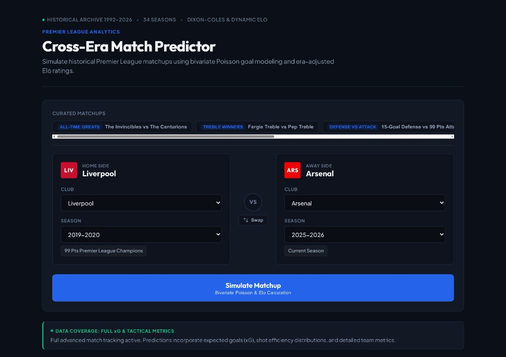
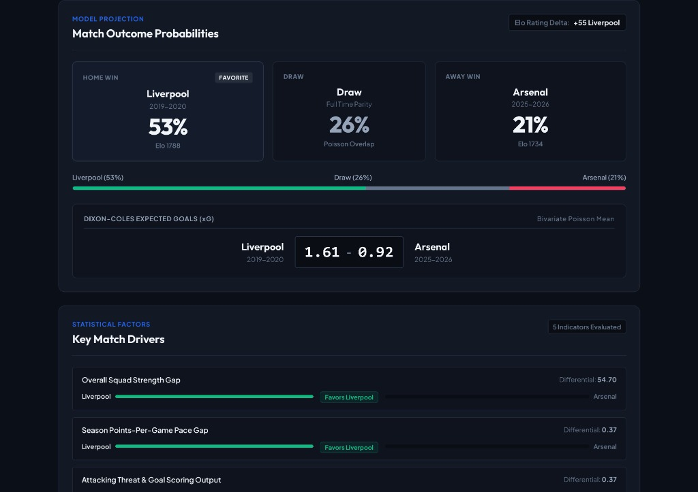
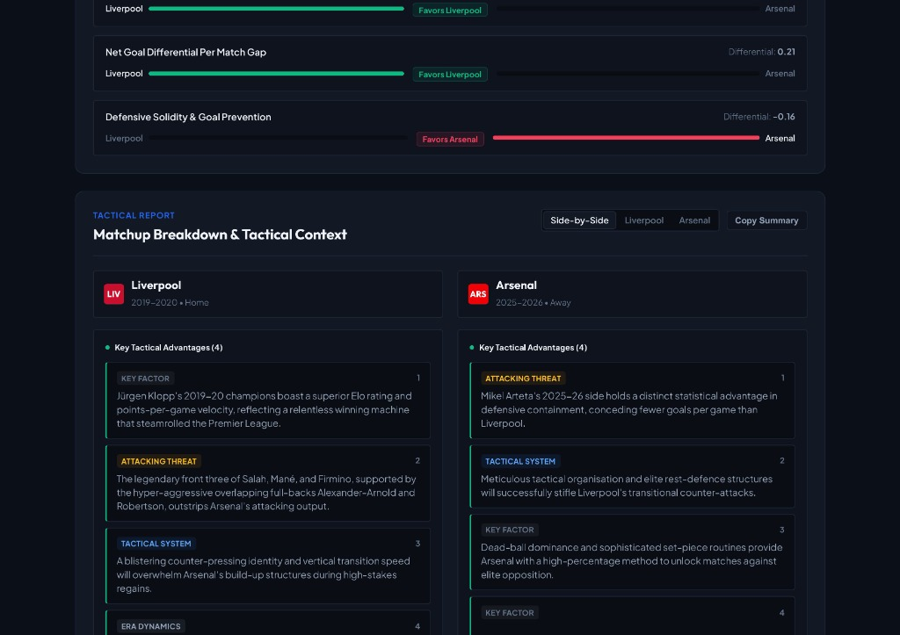

# EPL Cross-Era Match Predictor ⚽⚡

[](package.json)
[](https://epl-cross-era-match-predictor.pages.dev)
[](https://epl-predictor-backend-483bf.containers.snapdeploy.app/api/v1/health)
[](https://epl-predictor-backend-483bf.containers.snapdeploy.app/docs)
[](https://www.python.org/)
[](https://reactjs.org/)
[](https://fastapi.tiangolo.com/)
[](LICENSE)

A statistical machine learning simulation engine and broadcast-grade analytics dashboard for hypothetical cross-era Premier League matchups across **34 seasons of English football (1992–93 to 2025–26)**.

---

## 🌐 Live Deployments

- 🖥️ **Live Web Application**: [https://epl-cross-era-match-predictor.pages.dev](https://epl-cross-era-match-predictor.pages.dev)
- 🔌 **Production Backend API**: [https://epl-predictor-backend-483bf.containers.snapdeploy.app/api/v1](https://epl-predictor-backend-483bf.containers.snapdeploy.app/api/v1)
- 📖 **Interactive Swagger Docs**: [https://epl-predictor-backend-483bf.containers.snapdeploy.app/docs](https://epl-predictor-backend-483bf.containers.snapdeploy.app/docs)

---

## 📸 Interface Preview

### 1. Cross-Era Matchup Selector & Iconic Clash Presets
Select any two clubs across 34 Premier League seasons or choose curated legendary clashes (*The Invincibles 2003-04* vs *The Centurions 2017-18*, *Treble Royale*, *15-Goal Defense vs 99 Pts Attack*).



---

### 2. Dixon-Coles Bivariate Poisson Probabilities & Key Match Drivers
Live win/draw/loss probability distributions, expected goals (xG), Elo rating delta, and statistical differential indicators evaluating squad strength, points-per-game velocity, attacking potency, and defensive containment.



---

### 3. Studio Pundit Breakdown & Tactical Context
Dual-perspective tactical analysis featuring dynamic micro-tags (`KEY FACTOR`, `ATTACKING THREAT`, `TACTICAL SYSTEM`, `ERA DYNAMICS`) with real-time markdown synthesis and quick clipboard copy.



---

## 🌟 Core Features

- **Cross-Era Elo Engine**: Dynamic chronological Elo computation with margin-of-victory scaling and era-normalized home advantage across 12,000+ historical fixtures.
- **Dixon-Coles Bivariate Poisson Modeling**: Low-score parameter $\tau(\lambda, \mu, \rho)$ correlation adjustment correcting for football scoreline interdependencies ($0-0, 1-0, 0-1, 1-1$).
- **5-Factor Differential Analysis**: Multi-dimensional team comparative metrics across overall squad strength, points-per-game trajectory, attacking output, defensive solidity, and net goal differential.
- **Studio Pundit Breakdown**: Layer 2 tactical synthesis generated with structured heuristics and optional Google Gemini AI acceleration.
- **100% Free & Offline-Resilient**: Statistical simulation engine runs entirely on local SQLite database without requiring external API keys.
- **Broadcast-Grade Dark Mode UI**: Authentic club palettes, glassmorphism cards, and responsive stadium UI designed with Vanilla CSS tokens.

---

## 🏗️ System Architecture

```text
/
├── backend/
│   ├── app/
│   │   ├── api/v1/         # FastAPI endpoints (predict, teams, explanation, health)
│   │   ├── core/           # Configuration, CORS settings, env validation
│   │   ├── db/             # SQLAlchemy session & database schema
│   │   ├── ml/             # Dixon-Coles Poisson engine & Elo calculator
│   │   └── services/       # Predictor pipeline & LLM explanation services
│   ├── data/               # SQLite database & CSV data archives (34 seasons)
│   ├── migrations/         # Alembic database migrations
│   ├── tests/              # Comprehensive Pytest test suite (18 test cases)
│   └── Dockerfile          # Production container specification
├── frontend/
│   ├── src/
│   │   ├── components/     # MatchupSelector, ProbabilityDisplay, PunditBoard, KeyDrivers
│   │   ├── services/       # Axios API client layer
│   │   └── utils/          # Team metadata, color tokens, and clash presets
│   ├── public/             # Static assets & SPA routing rules
│   └── index.html
└── docs/
    └── images/             # UI showcase screenshots
```

---

## 🚀 Local Development Setup

### 1. Prerequisites
- **Python 3.11+**
- **Node.js 18+ & npm**

### 2. Backend Setup
```bash
cd backend
python -m venv .venv

# Windows (PowerShell)
.\.venv\Scripts\Activate.ps1

# macOS / Linux
source .venv/bin/activate

pip install -r requirements.txt

# Run migrations & seed data (if setting up fresh DB)
alembic upgrade head
python scripts/load_data.py

# Start FastAPI dev server
uvicorn app.main:app --reload --port 8000
```
API will be accessible at `http://localhost:8000` (Docs at `http://localhost:8000/docs`).

### 3. Frontend Setup
```bash
cd frontend
npm install
npm run dev
```
Open **`http://localhost:3000`** in your browser.

---

## 🧪 Testing

Run backend unit and integration test suite:

```bash
cd backend
pytest tests/ -v
```

```text
======================== 18 passed in 9.95s ========================
```

---

## 📡 API Reference

| Method | Endpoint | Description |
|---|---|---|
| `GET` | `/api/v1/health` | Health check & database connection status |
| `GET` | `/api/v1/teams` | List all 51 historical Premier League clubs |
| `GET` | `/api/v1/teams/{team_id}/seasons` | Available seasons and squad stats for a club |
| `POST` | `/api/v1/predict` | Run Dixon-Coles simulation & probability engine |
| `POST` | `/api/v1/explain` | Generate tactical pundit breakdown |

---

## 📄 License
This project is licensed under the MIT License — see the [LICENSE](LICENSE) file for details.
